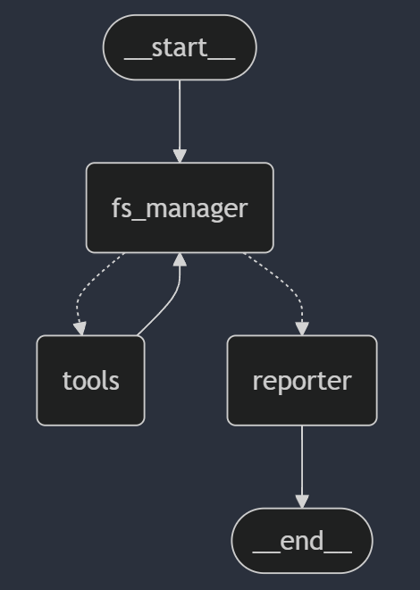

# Spaider Agent Template



## Overview

It's the agent template we'll be using/modifying for any agent-workflows we create.
`
## Project Structure

The project is organized into several key directories and files:

- `spaider_agent_temp/`: Contains the main application code.
  - `app.py`: Entry point of the application.
  - `graph.py`: Defines the state graph and its nodes.
  - `models/`: Contains model definitions.
  - `nodes_and_conditional_edges/`: Defines the nodes and conditional edges for the state graph.
  - `prompts/`: Contains prompt templates for different nodes.
  - `schemas.py`: Defines the state schema.
  - `tools/`: Contains tools that the agent can use, such as running batch scripts and getting the file tree.
- `testfolder/`: Contains test files and directories for the agent to interact with.
- `.gitignore`: Specifies files and directories to be ignored by Git.
- `pyproject.toml`: Configuration file for the project, including dependencies.

## Installation

To install the project, follow these steps:

1. Clone the repository:
   ```sh
   git clone <repository_url>
   cd spaider-agent-template
   ```

2. Install dependencies using Poetry:
   ```sh
   poetry install
   ```

3. Activate the virtual environment:
   ```sh
   poetry shell
   ```

## Usage

To run the application, execute the following command:
```sh
python app.py
```

The application will start an infinite loop, prompting the user for input and responding based on the defined state graph and prompts.

## Key Components

### Prompts

Prompts are defined in `spaider_agent_temp/prompts/prompts.py`. These prompts guide a given Node's behavior and responses. For example, the `FS_MANAGER_PROMPT` provides instructions for the FS_manager Node to interact with the file system.

### State Graph

The state graph is defined in `spaider_agent_temp/graph.py`. It includes nodes and edges that determine the flow of the application.
Graph building + compilation has been done there. The compiled graph object is then passed to the app.py file, where it's run along with other inputs.

### Nodes and Conditional Edges

Nodes and conditional edges are defined in `spaider_agent_temp/nodes_and_conditional_edges/nodes.py` and `spaider_agent_temp/nodes_and_conditional_edges/conditional_edges.py`. These files contain the logic for each node and the conditions for transitioning between nodes.

### Tools

Tools are defined in `spaider_agent_temp/tools/`. These tools allow the agent to perform specific actions, such as running batch scripts and retrieving the file tree.
